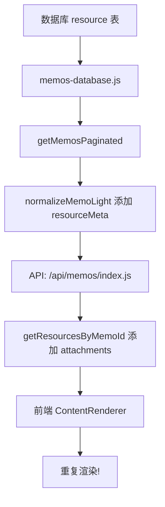

# 图片重复显示问题修复

## 问题分析

### 数据流



### 根本原因

1. **后端返回重复数据**
   - `resourceMeta`: 轻量级元数据（id, filename, type, size）
   - `attachments`: 完整数据（包含 blob）
   - 两者指向**同一批图片资源**

2. **前端重复渲染**
   - 第一套逻辑：通过 `resourceMeta` → 占位符 → ImageLoader → loadedImages → 轮播图
   - 第二套逻辑：通过 `attachments` → 附件列表 → 直接渲染图片/轮播图

### 示例数据

数据库中 ID=26 的 memo：
```sql
id: 26
content: "- [ ] 整理滴答清单\n\n"
resource: { id: 4, filename: "image.png", type: "image/png", size: 154839 }
```

API 返回：
```json
{
  "id": 26,
  "content": "- [ ] 整理滴答清单\n\n",
  "resourceMeta": [{ "id": 4, "filename": "image.png", "type": "image/png" }],
  "attachments": [{ "id": 4, "filename": "image.png", "type": "image/png", "blob": "..." }]
}
```

ContentRenderer 处理：
1. 检测到 `resourceMeta`，添加 `` → 渲染第一张图
2. 检测到 `attachments`，直接渲染 → 渲染第二张图
3. **结果：两张一样的图片**

## 修复方案

### ContentRenderer.jsx

```javascript
{/* 附件列表 - 🚀 只在没有 resourceMeta 时才显示，避免重复 */}
{memo && memo.attachments && memo.attachments.length > 0 && !memo.resourceMeta && (
  // ... 渲染逻辑
)}
```

### 修复逻辑

- ✅ 如果 memo 有 `resourceMeta`：使用占位符机制渲染（轻量级，按需加载）
- ✅ 如果 memo 只有 `attachments`：直接渲染附件列表
- ✅ 避免两者同时渲染

## 优化建议（可选）

### API 层面优化

`/api/memos/index.js`:
```javascript
// 为每个 memo 加载附件列表
const memosWithAttachments = result.memos.map(memo => {
  // 🚀 如果已有 resourceMeta，就不需要再加载 attachments
  if (memo.resourceMeta && memo.resourceMeta.length > 0) {
    return memo;
  }
  return {
    ...memo,
    attachments: db.getResourcesByMemoId(memo.id)
  };
});
```

## 测试验证

1. ✅ 单图 memo：只显示一张图片
2. ✅ 多图 memo：轮播图只出现一次
3. ✅ 双击编辑：能看到正确的图片引用
4. ✅ 无效引用清理：`./local/` 引用被自动移除

## 相关文件

- `src/components/ContentRenderer.jsx`: 前端渲染逻辑
- `pages/api/memos/index.js`: API 端点
- `lib/server/memos-database.js`: 数据库操作
- `components/nextjs/CompleteMemoApp.jsx`: 编辑逻辑

