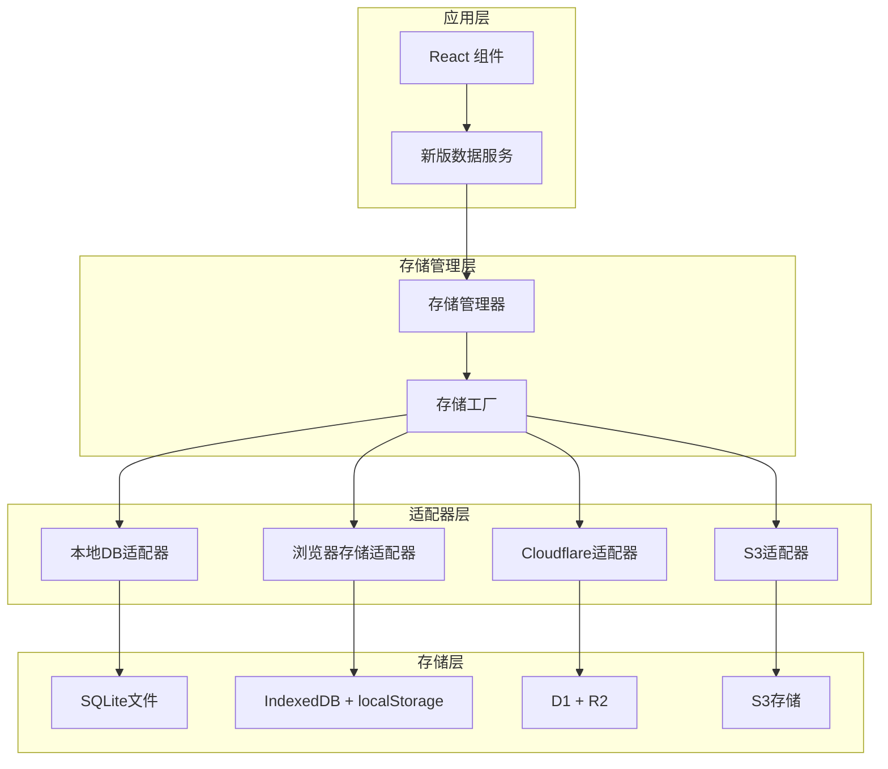

# MeowNocode 多存储方案

## 🎯 概述

基于原版 **memos** 项目的多驱动架构设计，MeowNocode 现在支持多种存储方式，让您可以根据需求选择最适合的数据存储方案。

### 🚀 核心特性

- **🔄 无缝切换**: 支持在不同存储方式间自由切换
- **📦 数据迁移**: 自动迁移现有数据到新的存储方式
- **🛡️ 兼容性**: 完全向后兼容现有功能
- **⚙️ 配置管理**: 图形化配置界面，简单易用
- **🔧 扩展性**: 易于扩展新的存储适配器

## 📊 支持的存储类型

### 1. 💾 **本地数据库文件** (默认推荐)

**优势**:
- ✅ 数据文件化，易于备份
- ✅ 兼容原版 memos 数据库
- ✅ 高性能 SQLite 数据库
- ✅ 支持导入/导出 .db 文件
- ✅ 离线完全可用

**限制**:
- ⚠️ 仅限单设备访问
- ⚠️ 需要手动备份

**适用场景**: 个人使用，注重数据安全和性能

### 2. 🌐 **浏览器存储**

**优势**:
- ✅ 无需配置，开箱即用
- ✅ 完全离线可用
- ✅ 响应速度最快

**限制**:
- ❌ 限制于单个浏览器
- ❌ 可能因清理缓存丢失数据
- ❌ 存储容量有限

**适用场景**: 临时使用，快速体验

### 3. ☁️ **Cloudflare Workers**

**优势**:
- ✅ 跨设备同步访问
- ✅ 全球 CDN 加速
- ✅ 高可用性和可靠性
- ✅ 免费额度充足

**限制**:
- ⚠️ 需要网络连接
- ⚠️ 需要配置部署

**适用场景**: 多设备使用，团队协作

### 4. 🪣 **S3 兼容存储** (计划中)

**优势**:
- ✅ 企业级可靠性
- ✅ 几乎无限容量
- ✅ 高度可定制

**限制**:
- ⚠️ 配置相对复杂
- ⚠️ 可能产生费用

**适用场景**: 企业使用，大规模数据

## 🏗️ 架构设计



## 🚀 快速开始

### 安装依赖

确保您已安装 `sql.js`：

```bash
npm install sql.js
```

### 基本使用

```javascript
import { newDataService } from '@/lib/newDataService.js';

// 初始化数据服务（自动选择最佳存储方式）
await newDataService.initialize();

// 创建备忘录
const memo = await newDataService.createMemo({
  content: '这是一个测试备忘录 #测试',
  tags: ['测试'],
  pinned: false
});

// 获取所有备忘录
const memos = await newDataService.getAllMemos();

// 获取存储信息
const storageInfo = await newDataService.getStorageInfo();
console.log('当前存储方式:', storageInfo.adapterType);
```

### 切换存储方式

```javascript
import { storageManager } from '@/lib/storage/StorageManager.js';

// 切换到本地数据库存储
await storageManager.switchStorageType('localdb', {
  dbPath: 'my-notes.db',
  autoSave: true,
  saveInterval: 30
}, true); // true = 迁移现有数据

// 切换到 Cloudflare 存储
await storageManager.switchStorageType('cloudflare', {
  baseURL: 'https://your-worker.workers.dev'
}, true);
```

## ⚙️ 配置选项

### 本地数据库配置

```javascript
{
  dbPath: 'meownocode.db',      // 数据库文件名
  autoSave: true,                // 自动保存
  saveInterval: 30              // 保存间隔(秒)
}
```

### Cloudflare 配置

```javascript
{
  baseURL: 'https://your-worker.workers.dev',  // Worker URL
  apiKey: 'optional-api-key'                    // 可选的API密钥
}
```

## 🔧 高级用法

### 1. 数据导入导出

```javascript
// 导出所有数据
const exportedData = await newDataService.exportData();

// 导入数据
await newDataService.importData(
  exportedData.memos, 
  exportedData.pinnedMemos
);
```

### 2. 本地数据库文件操作

```javascript
// 仅在本地DB模式下可用
if (storageManager.getCurrentStorageType() === 'localdb') {
  // 导出SQLite文件
  const dbFile = await newDataService.exportDatabaseFile();
  
  // 导入SQLite文件
  const fileInput = document.createElement('input');
  fileInput.type = 'file';
  fileInput.onchange = async (e) => {
    const file = e.target.files[0];
    await newDataService.importDatabaseFile(file);
  };
  fileInput.click();
}
```

### 3. 批量操作

```javascript
const operations = [
  { type: 'create', data: { content: '备忘录1', tags: [] } },
  { type: 'create', data: { content: '备忘录2', tags: ['工作'] } },
  { type: 'update', id: 'memo-123', data: { content: '更新内容' } }
];

const results = await newDataService.batchOperation(operations);
console.log(`${results.filter(r => r.success).length} 个操作成功`);
```

### 4. 健康检查

```javascript
const health = await newDataService.healthCheck();
if (!health.healthy) {
  console.warn('存储服务异常:', health.reason);
}
```

## 🖥️ UI 集成

### 在设置中添加存储选择器

```jsx
import StorageSelector from '@/components/StorageSelector';
import { useState } from 'react';

function SettingsPage() {
  const [showStorageSelector, setShowStorageSelector] = useState(false);
  
  return (
    <div>
      <button onClick={() => setShowStorageSelector(true)}>
        存储设置
      </button>
      
      <StorageSelector
        isOpen={showStorageSelector}
        onClose={() => setShowStorageSelector(false)}
        onStorageChanged={(type, config) => {
          console.log('存储已切换:', type, config);
          // 刷新界面数据
        }}
      />
    </div>
  );
}
```

## 📦 数据迁移

### 从旧版本升级

如果您已有使用浏览器存储的数据，升级到新版本后：

1. **自动检测**: 系统会自动检测现有数据
2. **选择存储**: 在设置中选择新的存储方式
3. **一键迁移**: 点击"使用此存储"时会自动迁移数据
4. **数据验证**: 迁移后验证数据完整性

### 从 memos 导入

```javascript
// 导入 memos 数据库文件
const memosFile = /* 用户选择的 .db 文件 */;

// 切换到本地DB模式
await storageManager.switchStorageType('localdb');

// 导入文件
await newDataService.importDatabaseFile(memosFile);
```

## 🔍 故障排除

### 常见问题

**Q: 切换存储方式后数据丢失？**
A: 确保在切换时选择了"迁移数据"选项。如果仍有问题，检查浏览器控制台错误信息。

**Q: 本地数据库模式无法初始化？**
A: 确保浏览器支持 WebAssembly 和 IndexedDB。部分隐私模式可能限制这些功能。

**Q: Cloudflare 存储连接失败？**
A: 检查 Worker URL 是否正确，确保 Worker 已正确部署且健康检查接口可访问。

**Q: 数据同步问题？**
A: 检查网络连接，确认所选存储方式的健康状态。

### 调试模式

```javascript
// 开启详细日志
localStorage.setItem('DEBUG_STORAGE', 'true');

// 获取存储统计
const stats = await storageManager.getStorageStats();
console.log('存储统计:', stats);

// 测试存储连接
const testResult = await storageManager.testStorageType('cloudflare', {
  baseURL: 'https://your-worker.workers.dev'
});
console.log('连接测试:', testResult);
```

## 🔄 版本兼容性

### v1.x -> v2.x 升级

1. **数据备份**: 升级前导出现有数据
2. **代码更新**: 更新到新版本
3. **服务初始化**: 新版会自动初始化存储管理器
4. **数据验证**: 验证数据迁移完整性

### API 变更

新版本保持了完全的向后兼容性，旧的 API 调用仍然有效：

```javascript
// 旧版 API（仍然支持）
const memos = JSON.parse(localStorage.getItem('memos') || '[]');

// 新版 API（推荐）
const memos = await newDataService.getMemos();
```

## 📚 扩展开发

### 创建自定义存储适配器

```javascript
import { StorageAdapter } from '@/lib/storage/StorageAdapter.js';

class MyCustomAdapter extends StorageAdapter {
  async initialize() {
    // 初始化逻辑
  }
  
  async createMemo(memoData) {
    // 创建备忘录逻辑
  }
  
  // 实现其他必需方法...
}

// 注册到工厂
import { storageFactory } from '@/lib/storage/StorageFactory.js';
// 添加到支持的存储类型配置...
```

### 添加新的配置字段

在 `StorageFactory.js` 中的 `STORAGE_TYPE_CONFIGS` 添加新配置：

```javascript
[STORAGE_TYPES.CUSTOM]: {
  name: '自定义存储',
  description: '我的自定义存储方案',
  icon: '🎯',
  configFields: [
    { key: 'endpoint', label: '端点地址', type: 'text', required: true },
    { key: 'timeout', label: '超时时间', type: 'number', default: 5000 }
  ]
}
```

## 🚀 性能优化

### 最佳实践

1. **选择合适的存储方式**
   - 个人使用：本地数据库
   - 多设备同步：Cloudflare
   - 临时测试：浏览器存储

2. **数据管理**
   - 定期备份重要数据
   - 清理不需要的附件
   - 使用标签组织数据

3. **性能优化**
   - 启用自动保存（本地DB）
   - 合理设置保存间隔
   - 使用批量操作处理大量数据

---

**💡 提示**: 这个多存储方案参考了企业级 memos 项目的架构设计，为您提供了生产级的可扩展解决方案，同时保持了使用的简单性。